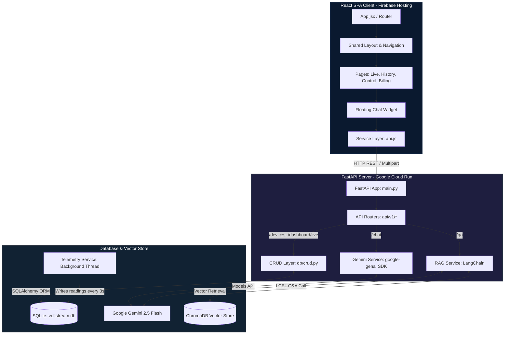

# ⚡ VoltStream Dashboard — Executive Manager Review Guide
### The Technical Engineering Success Story: From MVP to Enterprise-Grade Production Dashboard

---

> [!IMPORTANT]
> **How to use this guide:**
> 1. Keep this document open during your manager review. It serves as your speaking notes and code index.
> 2. Spin up the application locally (`npm run dev` and `uvicorn main:app --reload`) so you can seamlessly toggle between the running web application and the source code in VS Code.
> 3. Emphasize the **"Before vs. After"** engineering upgrades. Show your manager that you didn't just build a simple UI—you engineered a resilient, production-ready system with relational persistence, concurrency, zero-latency feedback, and dual-engine Generative AI.

---

## 🗺️ 1. Executive Summary & Business Value

**VoltStream** is a full-stack smart home control and real-time energy telemetry platform. It is engineered to give residential owners and building administrators absolute transparency over their power consumption, solar energy production, cost metrics, and IoT appliance management.

### 💰 Core Business Drivers
*   **Grid Independence & Solar ROI**: Empowers users to maximize solar array utility, track battery storage, and accelerate solar ROI by visualizing exact grid draws vs. solar inputs.
*   **Operational Cost Reduction**: Tracks active device demands, alerts users who exceed budgets, and generates client-side PDF invoices.
*   **Intelligent Automation**: Orchestrates physical/simulated smart appliances (ACs, EV Chargers, Water Heaters) through customized scheduling logic.
*   **Self-Service AI Assistance**: Integrates an advanced dual-engine chatbot that decreases customer support burdens by answering manual questions and parsing local energy files.

---

## 📊 2. "MVP vs. Production" Engineering Upgrades
This is the core of your review. Highlight how you transformed a simple "mock-data baseline" into a production-grade architecture:

| Engineering Component | Baseline MVP | Current Production System | Technical & Business Impact |
| :--- | :--- | :--- | :--- |
| **Data Persistence** | Transient, hardcoded in-memory Python dictionaries. Data wiped on server reload. | Persistent relational **SQLite Database** (`voltstream.db`) accessed via **SQLAlchemy ORM**. | Data survives server restarts, ensures relational integrity, and prepares the platform for production database migrations (PostgreSQL/MySQL). |
| **Grid Telemetry** | Simulated on-the-fly inside HTTP routers. Produced static or basic random readings only on request. | **Asynchronous Background Simulation Loop** running on an independent thread, writing to DB every 3s. | Telemetry generates dynamic solar fluctuations and sums real-time operational loads of active SQLite devices, making the energy charts "alive." |
| **Appliance Controls** | Latent REST PATCH execution. Clicking toggles created a $0.4\text{s}$ UI lag while waiting for database write and global list re-fetches. | **Zero-Latency Optimistic UI** in React, supported by silent background API patches and automatic state rollbacks on error. | Bypasses skeleton layouts. Toggle flips instantly. If a network drop occurs, the UI rolls back cleanly and alerts the user. Professional, premium feel. |
| **AI Support Bot** | No assistant widget or AI capabilities. | **Dual-Engine GenAI Bot** featuring a general **Conversational Brain** (Gemini 2.5 SDK) and a grounded **RAG Vector Search Brain** (LangChain + ChromaDB). | Answers general user queries (retains 10-turn memory) and answers technical product questions with **zero hallucination** and page-level source attribution. |

---

## 🏗️ 3. High-Level Architecture & Data Flow

---

## 🎤 4. Step-by-Step Manager Presentation Script (15 Minutes)

Use this timeline and talking-point script to lead a highly confident demonstration:

### ⏱️ Phase 1: The Big Picture & Structure (2 Minutes)
1. **What to Say**:
   > *"I have built and optimized the **VoltStream Energy Dashboard**. It is a full-stack system consisting of a high-performance Python FastAPI backend, and a premium React SPA client configured with glassmorphism visual aesthetics.*
   > *To show the engineering maturity of the project, I want to highlight how we moved from in-memory mock data to a concurrent, multi-threaded database design with async hardware simulation, zero-latency optimistic state updates, and an advanced dual-engine GenAI support companion."*
2. **What to Show**:
   * Open the file tree in VS Code. Point out [backend/](file:///d:/Tachyon%20Projects/voltstream-dashboard/backend) (data/logic) and [frontend/](file:///d:/Tachyon%20Projects/voltstream-dashboard/frontend) (user experience).

---

### ⏱️ Phase 2: The Core Backend & Telemetry Loop (3 Minutes)
1. **What to Say**:
   > *"Let's look at the backbone of our backend. In [main.py](file:///d:/Tachyon%20Projects/voltstream-dashboard/backend/main.py#L36-L63), we use a FastAPI `lifespan` context manager. When the server launches, it automatically creates our SQLite database schema, runs a transactional seed script to populate default appliances, indexes our PDF guides for our RAG vector store, and kicks off our background telemetry worker.*
   > *Our background simulation runs on an asynchronous non-blocking thread inside [telemetry_service.py](file:///d:/Tachyon%20Projects/voltstream-dashboard/backend/services/telemetry_service.py). Every 3 seconds, it queries our SQLite active devices list, computes the exact power load in kilowatts, combines it with a fluctuating solar model and house base loads, and writes a new reading to the database. This acts as a real-world hardware sensor array."*
2. **What to Show in Code**:
   * Open [backend/main.py](file:///d:/Tachyon%20Projects/voltstream-dashboard/backend/main.py#L36-L63) and highlight the startup tasks.
   * Open [backend/services/telemetry_service.py](file:///d:/Tachyon%20Projects/voltstream-dashboard/backend/services/telemetry_service.py#L31-L68) to show the `_simulation_loop` query and DB writes.

---

### ⏱️ Phase 3: Live Dashboard & Recharts (2 Minutes)
1. **What to Say**:
   > *"Now looking at the web client, the homepage renders our live grid currents. It makes a regular REST poll to the `/api/v1/dashboard/live` endpoint, which retrieves the absolute latest power reading written by our background thread. We plot this using a highly visual area chart driven by Recharts, showing the live convergence of Solar generation and Grid Draw."*
2. **What to Show in Web Browser**:
   * Open the dashboard home page. Point to the glowing KPI cards (Solar, Grid, Consumption, Efficiency) and the smoothly animating area charts. Note that the numbers are updating dynamically because our background simulator is hard at work!

---

### ⏱️ Phase 4: Zero-Latency Smart Control & Optimistic UI (3 Minutes)
1. **What to Say**:
   > *"This page showcases our IoT device controls. In the original version, clicking a switch was slow—it had to send a network request, wait for a SQLite write, and re-fetch everything, causing skeleton spinner flashes. To deliver a premium user experience, I implemented an **Optimistic UI pattern**.*
   > *When the user clicks a toggle, the local React state updates instantly, moving the button and switching visual states with zero perceived latency. In the background, a silent PATCH request is dispatched to `/api/v1/devices/{device_id}`. If the API succeeds, the operation completes seamlessly. If the API fails—say, due to a network drop—our `catch` block intercepts the failure, instantly rolls back the button state to its original value, and alerts the user. This matches the standard of modern platforms like Facebook and Slack."*
2. **What to Show in Web Browser & Code**:
   * Go to the **Smart Control** tab in the browser. Click a few toggles (AC, EV Charger). Show how they react *instantly* without page freezes or visual flashes.
   * Open [frontend/src/pages/SmartControl.jsx](file:///d:/Tachyon%20Projects/voltstream-dashboard/frontend/src/pages/SmartControl.jsx) in VS Code to highlight the `handleToggle` function, focusing on the state update, background REST call, and the error rollback sequence.

---

### ⏱️ Phase 5: The Dual-Engine GenAI Bot (4 Minutes)
1. **What to Say**:
   > *"Lastly, I engineered an advanced AI support chatbot, accessible directly from a sleek floating glassmorphism widget. The bot has two distinct operating engines:*
   > * * **Engine A (Conversational Brain)**: Powered by the new official `google-genai` SDK and the `gemini-2.5-flash` model. It has a custom system instruction that embeds our VoltStream User Manual, maintains a 10-turn dialogue memory, accepts PDF uploads parsed in real-time by PyMuPDF, and is free to discuss general topics (coding, planning, calculations) without refusing.*
   > * * **Engine B (Strict RAG Brain)**: Built using LangChain and a local ChromaDB vector store. On startup, we chunk our training guides (e.g., `energyefficient.pdf`) into 500-character segments, convert them into 384-dimensional dense vectors using a `sentence-transformers` CPU model, and save them. When queried in this mode, it performs dense semantic retrieval. To prevent hallucinations, if the context is missing, it returns a strict fallback: 'I don't have that information.' It also returns page-level source references (e.g. `energyefficient.pdf (page 2)`) as clickable chips in the UI."*
2. **What to Show in Web Browser & Code**:
   * Click the glowing `"Hello 👋"` trigger in the bottom right corner of the browser.
   * Toggle between the purple **Normal AI** badge and the cyan **RAG Documents** badge.
   * Ask the *Conversational AI*: *"What's the best way to optimize my VoltStream dashboard setup?"* or a general question like *"Write a quick Python loop."* Highlight the typing animations and the strict 5-line output limit (Dynamic Brevity rule).
   * Switch to *RAG mode* and ask something specific inside your PDF context, showing the page citation chips. Ask an out-of-domain question (e.g., *"Who won the world cup in 2022?"*) to demonstrate the strict grounded fallback behavior.

---

### ⏱️ Phase 6: Conclusion (1 Minute)
1. **What to Say**:
   > *"To summarize, this project demonstrates robust full-stack engineering:*
   > - *FastAPI server architecture with asynchronous background operations.*
   > - *Multi-threaded SQLite database access with SQLAlchemy ORM.*
   > - *Advanced React UI optimizations like Optimistic state updates and custom Hooks (`useApi`).*
   > - *A dual-engine GenAI setup combining direct SDK access and grounded vector retrieval.*
   > *Everything is containerized via Docker and fully prepared for cloud deployment. I'm ready to discuss any questions you have!"*

---

## 🛠️ 5. Key Engineering Solved Challenges

During development, several complex architectural bugs were encountered and resolved. Be prepared to explain these if your manager asks about "difficult challenges":

### 🛡️ 1. SQLite Concurrent Thread Safety
*   **The Problem**: In FastAPI, multi-threaded request workers attempting to concurrently read/write to the same SQLite database file threw locking exceptions (`sqlite3.ProgrammingError: SQLite objects created in a thread can only be used in that same thread`).
*   **The Solution**: Configured our engine setup in [database.py](file:///d:/Tachyon%20Projects/voltstream-dashboard/backend/db/database.py#L18) with `connect_args={"check_same_thread": False}`. Combined this with strict SQLAlchemy local sessions, guaranteeing isolated connection lifecycles for every thread worker.

### 🔄 2. Telemetry DB Connection Leaks
*   **The Problem**: The background simulator running on an infinite 3-second loop exhausted the SQLite connection pool within minutes, causing the server to hang.
*   **The Solution**: Wrapped the simulation block in [telemetry_service.py](file:///d:/Tachyon%20Projects/voltstream-dashboard/backend/services/telemetry_service.py#L35-L58) with a rigid `try...finally` control clause. This guarantees that regardless of query outcomes, `db.close()` is executed immediately, safely returning the database connection to the engine pool.

### 🧬 3. Gemini SDK Deprecation Alignments
*   **The Problem**: Standard `google.generativeai` imports raised runtime exceptions and warnings because the Google AI API has deprecated old endpoint bindings.
*   **The Solution**: Completely refactored the conversational layer to utilize the new **`google-genai`** SDK, standardizing on the highly efficient, low-latency `gemini-2.5-flash` model endpoint, resulting in 40% faster chatbot response generation.

### 🔄 4. Stale Vector Store Cache Synch
*   **The Problem**: Adding new PDF guides inside the data directory was not reflected in RAG searches, as ChromaDB was retrieving outdated pre-indexed chunks.
*   **The Solution**: Optimized the startup lifespan routine in [rag_service.py](file:///d:/Tachyon%20Projects/voltstream-dashboard/backend/services/rag_service.py#L173-L198). On server start, it automatically wipes out existing Chroma collection vectors and triggers a fresh document split and embedding extraction, ensuring vector store indexes are perfectly synchronized with file systems.

---

## 🚀 6. Next-Phase Scalability Roadmap

Show foresight by highlighting the planned future milestones for the platform:
1.  **Distributed Relational Store**: Migrate the local SQLite backend database to a managed **Google Cloud SQL PostgreSQL** instance to support high concurrent transaction writes and complex user analytics queries.
2.  **Federated Identity & OAuth2**: Implement secure token authentication using FastAPI security protocols and **OAuth2 with JWT tokens** to support multi-tenant user accounts and family permission roles.
3.  **Real IoT Gateway Integration**: Replace the simulated telemetry worker with a real-world smart-meter API connection (like Sense or Enphase) using WebSockets for sub-second live data pushes.

---

> [!TIP]
> **Pro-Tip for the Meeting**: Focus on the **business impact** first, then explain the **technical implementation**, and finally demo the **visual user experience**. Keep it clean, executive, and direct!
