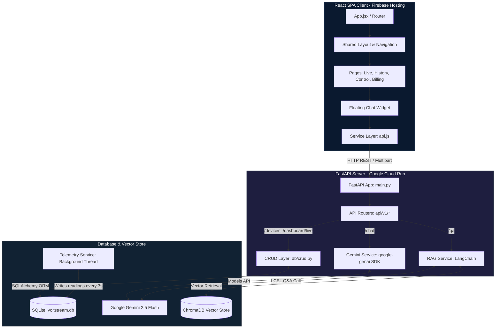
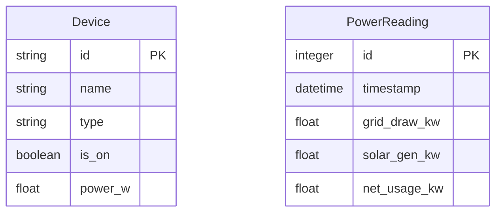

# ⚡ VoltStream Dashboard — Production Technical Documentation
### Enterprise-Grade Full-Stack Energy Monitoring Dashboard with Dual-Engine GenAI & SQLite Telemetry

---

> [!NOTE]
> This document serves as the single source of truth for the **VoltStream Dashboard** architecture. It has been fully updated to reflect the transition from static mock data to a production-grade relational database (SQLite), background async telemetry workers, zero-latency Optimistic UI controls, and a dual-engine GenAI system (Gemini 2.5 Flash SDK + LangChain & ChromaDB RAG).

---

## 🗺️ 1. Executive Project Overview

VoltStream is an advanced, full-stack energy monitoring and smart home control platform. It provides household users and property administrators with real-time insights into energy consumption, solar energy production, cost projections, and intelligent device automation.

### 🚀 Core Business Value & Features
*   **Real-Time Energy Telemetry**: Live tracking of grid electricity draw, solar panel generation, battery efficiency, and carbon offset statistics.
*   **Intelligent IoT Device Control**: A remote command center to toggle and monitor smart home appliances (HVAC, EV chargers, water heaters) with zero perceived latency.
*   **Dynamic Usage History**: High-fidelity data visualization tracking daily, weekly, and monthly consumption trends.
*   **Financial Insights & Billing**: Interactive budget threshold management and dynamic PDF invoice generation on the client side.
*   **Dual-Engine GenAI Chatbot (VoltStream Bot)**: 
    1.  *General Brain Mode*: Highly creative, conversational companion that is fully aware of the VoltStream Platform Manual, retains chat history context, and accepts optional PDF attachments for general querying.
    2.  *Strict RAG Q&A Mode*: Grounded vector search that queries local PDF document indices to provide zero-hallucination answers, returning strict fallback messages when information is missing.

---

## 🏗️ 2. System Architecture & Component Mapping

VoltStream is built using a modern, loosely coupled three-tier architecture:



### 📁 Directory Structure Breakdown
```
voltstream-dashboard/
├── backend/                  ◄── FastAPI Web Server (ASGI)
│   ├── main.py               ◄── Entry point, Lifespan initialization, CORS, Middleware
│   ├── requirements.txt      ◄── Python dependencies (fastapi, uvicorn, langchain, google-genai, PyMuPDF)
│   ├── Dockerfile            ◄── Containerization configuration
│   ├── voltstream.db         ◄── SQLite Database file (generated on startup)
│   ├── api/                  ◄── REST Routing Layer
│   │   ├── api.py            ◄── Aggregated router registration under /api/v1
│   │   ├── dashboard.py      ◄── Real-time grid/solar stats endpoint
│   │   ├── analytics.py      ◄── Historical analytics data endpoint
│   │   ├── devices.py        ◄── Smart appliance fetch and patch endpoints
│   │   ├── billing.py        ◄── Balance summaries and billing details
│   │   ├── chat.py           ◄── General AI chat endpoint (Gemini SDK)
│   │   └── qa.py             ◄── Strict RAG document search endpoint
│   ├── core/
│   │   └── config.py         ◄── Base settings & configuration schema via Pydantic
│   ├── db/                   ◄── Database Storage & Schema Layer
│   │   ├── database.py       ◄── SQLAlchemy SessionLocal & connection engine
│   │   ├── models.py         ◄── SQLAlchemy relational schema models (Device, PowerReading)
│   │   ├── mock_db.py        ◄── Base seed values for startup
│   │   └── crud.py           ◄── DB transaction operations (insert, query, fluctuation)
│   ├── schemas/              ◄── Pydantic Request/Response Models
│   └── services/             ◄── Business Logic & LLM Integrations
│       ├── telemetry_service.py ◄── Async background simulated sensor loop
│       ├── gemini_service.py ◄── google-genai SDK wrapper (General chat & PyMuPDF text parser)
│       └── rag_service.py    ◄── LangChain LCEL RAG pipe (SentenceTransformers, ChromaDB)
│
└── frontend/                 ◄── Single Page Application (SPA) React Client
    ├── vite.config.js        ◄── Vite build manager
    ├── tailwind.config.js    ◄── Styling framework configurations
    ├── package.json          ◄── Node dependencies (React Router, Axios, Recharts, jsPDF, Lucide Icons)
    ├── firebase.json         ◄── Firebase Hosting deployment blueprint
    └── src/
        ├── main.jsx          ◄── React entry point & wrapper rendering
        ├── App.jsx           ◄── Router declarations and layout wrapper mounts
        ├── index.css         ◄── Tailored premium glassmorphism & visual layout utilities
        ├── components/
        │   ├── Layout.jsx    ◄── Shared sidebar navigation, search routing, dynamic headers
        │   └── FloatingChat.jsx ◄── Dual-engine GenAI chatbot window
        ├── pages/
        │   ├── LiveDashboard.jsx ◄── Live metrics, Recharts energy flows, stats summaries
        │   ├── UsageHistory.jsx  ◄── Dynamic analytics chart, calculations, filters
        │   ├── SmartControl.jsx  ◄── Grid of active appliances (Optimistic UI toggles + automation)
        │   ├── Invoices.jsx      ◄── Ledger billing sheets, budget trackers, jsPDF generator
        │   └── NotFound.jsx      ◄── Custom 404 page
        ├── hooks/
        │   └── useApi.js         ◄── Reusable API fetch states (data, loading, error states)
        └── services/
            └── api.js            ◄── Automated environment-switching Axios API client
```

---

## 💾 3. Backend Database & Asynchronous Telemetry Layer

One of the most critical structural upgrades is the complete transition from transient, in-memory objects to a persistent SQLite database (`voltstream.db`) accessed via the SQLAlchemy Object-Relational Mapper (ORM), driven by a background simulation service.

### 🗄️ Relational Database Schema (`backend/db/models.py`)

1.  **`Device` Table**: Maps physical IoT hardware details.
    *   `id` (String, Primary Key): Unique device identifier (e.g., `dev_01`).
    *   `name` (String): Display name (e.g., `Living Room AC`).
    *   `type` (String): Category (e.g., `hvac`, `lighting`, `appliance`).
    *   `is_on` (Boolean): Active operating state.
    *   `power_w` (Float): Real-time electricity draw in Watts.
2.  **`PowerReading` Table**: Stores chronological sensor telemetry data points.
    *   `id` (Integer, Primary Key, Auto-increment): Unique entry row.
    *   `timestamp` (DateTime, indexed): Moment the reading was recorded.
    *   `grid_draw_kw` (Float): Power pulled from municipal power grid (kW).
    *   `solar_gen_kw` (Float): Power generated by solar array (kW).
    *   `net_usage_kw` (Float): Computed net footprint (`grid_draw - solar_gen`) in kW.



### 🛰️ Asynchronous Telemetry Simulator (`backend/services/telemetry_service.py`)

A background loop is executed inside an `asyncio` task within the FastAPI `lifespan` manager, acting as a real-time hardware simulator:

*   **Concurrency**: Implements non-blocking `asyncio.sleep(3)` intervals to query and update SQLite records without pausing incoming API requests.
*   **Dynamic Load Computations**:
    1.  Calculates `total_device_kw` by summing all active devices in the database:
        $$\text{total\_device\_kw} = \sum (\text{power\_w of devices where is\_on = True}) / 1000$$
    2.  Generates realistic fluctuating solar output (between $2.0\text{ kW}$ and $5.5\text{ kW}$).
    3.  Calculates real-time grid draw with a static base house load ($0.4\text{ kW}$) plus active device loads and minor noise.
*   **Active Load Fluctuation**: Executes a randomized minor fluctuation ($-10.5\text{ W}$ to $+12.5\text{ W}$) for active devices to simulate operational voltage variances.
*   **Database Archival**: Saves a new `PowerReading` row in the database every 3 seconds, which is instantly queried by the `/api/v1/dashboard/live` endpoint.

---

## 🤖 4. Dual-Engine GenAI & RAG Pipeline

The chat infrastructure utilizes a dual-engine architecture to offer both general cognitive capabilities and absolute, zero-hallucination fact retrieval from structured company documents.

```
                  ┌───────────────────────┐
                  │   User Chat Request   │
                  └───────────┬───────────┘
                              │
               Mode Selected (AI vs. RAG)
               ┌──────────────┴──────────────┐
               ▼                             ▼
       [Normal AI Mode]               [Strict RAG Mode]
       /api/v1/chat                   /api/v1/qa
       ┌───────┴───────┐              ┌───────┴───────┐
       │  Gemini SDK   │              │  LangChain    │
       │ (2.5-Flash)   │              │ (2.5-Flash)   │
       │               │              │               │
       │ System Manual │              │ Chroma Vector │
       │ Memory (10)   │              │ Retrieval     │
       │ Optional PDF  │              │               │
       └───────┬───────┘              └───────┬───────┘
               │                              │
               │                              ├─► Match Found?
               │                              │     │ Yes: Generate Grounded Answer
               │                              │     └─► No: Return "I don't have..."
               ▼                              ▼
     ┌──────────────────────────────────────────┐
     │           Final Unified Output           │
     └──────────────────────────────────────────┘
```

### 🧠 Engine A: Conversational Brain (`/api/v1/chat/`)
Powered by the new official **`google-genai`** SDK, this mode is configured to answer any general question while acting as a platform support expert.

*   **Platform Knowledge**: Configured via a `SYSTEM_PROMPT` that embeds the complete VoltStream Platform Manual (describing dashboard functionalities, device categories, billing capabilities, and reporting features).
*   **Conversational Memory**: The endpoint accepts an optional `history` JSON array containing past messages. The backend parses and injects the last 10 historical conversation turns to preserve multi-turn continuity.
*   **Optional Document Parsing**: If a user uploads a PDF directly into the chat interface, the system reads and parses it in real time using **PyMuPDF (`fitz`)**, appending it to the query prompt.
*   **Fallback Strategy**: Always relies on the LLM's broader knowledge base for off-topic, creative, or general requests. It never refuses a question.

### 📚 Engine B: Grounded RAG Brain (`/api/v1/qa/`)
A highly restricted, zero-hallucination document-QA system implemented via **LangChain** and **ChromaDB**, designed to strictly search indexed local documentation.

*   **Ingestion Pipeline**: 
    1.  *Loader*: Checks `backend/data/` for PDF guides (e.g., `energyefficient.pdf`) on startup and reads pages via `PyPDFLoader`.
    2.  *Text Splitter*: Employs `RecursiveCharacterTextSplitter` to partition texts into chunks of $500$ characters with a $100$-character overlap for accurate context retrieval.
    3.  *Embeddings*: Generates 384-dimensional dense vectors using **`sentence-transformers/all-MiniLM-L6-v2`** (cached locally and executed on CPU).
    4.  *Vector Database*: Populates and searches a persistent **ChromaDB** instance saved at `backend/db/chroma_db/`.
*   **Grounded Prompt Logic**: Instructs Gemini to answer queries strictly and solely based on retrieved document chunks.
*   **Zero Hallucination Guarantee**: If the document context does not contain the answer, the LLM is restricted from using its general knowledge. It returns exactly: `"I don't have that information."`
*   **Page-Level Source Attribution**: Dynamically gathers metadata from retrieved vector chunks and displays the exact source file and page number (e.g., `energyefficient.pdf (page 3)`) as clickable chips in the UI.

---

## ⚡ 5. Frontend Optimizations & UI Enhancements

To achieve a production-grade experience, significant performance and styling updates were engineered into the React SPA client.

### 🏎️ Latency Optimization: Device Toggle Optimistic UI
Previously, toggling an IoT device switch would incur a noticeable lag (around $0.4\text{s}$) because the client awaited the server response before re-fetching the entire list, resulting in skeleton loader flashes:

```
[Legacy]:   Click Toggle ──► Send API Patch ──► Wait for DB Write ──► Re-fetch All ──► Render Updated state (0.4s Lag)
[Optimistic]: Click Toggle ──► UI Toggles Instantly ──► Send API Patch in BG ──── (Seamless / Zero-Latency)
                                                        └─► On Error: Rollback state & Alert
```

**Optimistic Implementation (`frontend/src/pages/SmartControl.jsx`)**:
1.  **Immediate UI Toggle**: The frontend `localDevices` state updates the target device's active state instantly upon the `onClick` event.
2.  **Background REST Request**: Dispatches the `api.toggleDevice` PATCH request in the background. The interface bypasses global list refreshes or skeleton layouts.
3.  **Automatic State Rollback**: If the network request fails (e.g., connection lost or 404), the `catch` block catches the error, immediately rolls the local state back to the previous toggle value, and alerts the user.

### 🎨 Premium Floating Chat UI Refinement (`FloatingChat.jsx`)
The floating assistant widget has been polished to present a gorgeous glassmorphism interface that matches modern enterprise standards:

*   **Simplified Floating Trigger**: Removed the large text notification bubble ("Ask VoltStream Bot") to reduce visual clutter, replacing it with a neat, sleek `"Hello 👋"` floating tooltip.
*   **Typing Animators**: Implemented high-frame rate CSS keyframe bouncers (`vsDotBounce`) to render fluid bouncing loaders while awaiting responses.
*   **Mode Switcher**: Provides an integrated, color-coded badge button (Violet/Gemini for Normal AI, Cyan/Chroma for RAG Documents) allowing users to switch models mid-chat with ease.

---

## 📋 6. Complete API Endpoint Catalogue

The FastAPI backend exposes the following structured REST interface under the `/api/v1` prefix:

| Endpoint | Method | Request Payload | Response Model | Description |
| :--- | :--- | :--- | :--- | :--- |
| `/` | `GET` | *None* | *JSON object* | Basic API health status, server uptime, and timestamp. |
| `/dashboard/live` | `GET` | *None* | `LivePowerStatus` | Fetches the latest simulated grid, solar, and net power metrics from SQLite. |
| `/analytics/history` | `GET` | Query Parameter: `period` (`daily`, `weekly`, `monthly`) | `AnalyticsResponse` | Returns aggregated generation and consumption arrays to build charts. |
| `/devices` | `GET` | *None* | `List[DeviceResponse]` | Fetches all smart appliances and their current status with a realistic async delay. |
| `/devices/{device_id}`| `PATCH`| `DeviceUpdate` | `DeviceResponse` | Modifies an appliance state (ON/OFF) in the database and updates load draws. |
| `/billing/summary` | `GET` | *None* | `BillingSummary` | Retrieves account balance, projected bills, and budget threshold limits. |
| `/chat/` | `POST` | Form: `message`, `history` (JSON str), `pdf` (optional File) | `ChatResponse` | Connects to the main Gemini 2.5 Flash SDK, parsing history and optional PDFs. |
| `/qa/` | `POST` | `QARequest` | `QAResponse` | Strict, document-grounded vector Q&A querying local Chroma DB indices. |

---

## 🛠️ 7. Technical Challenges & Engineering Solutions

### 🛡️ 1. SQLite Concurrent Thread Safety
*   **Problem**: In FastAPI, multi-threaded worker requests accessing SQLite concurrently raised thread connection crashes.
*   **Solution**: Added `connect_args={"check_same_thread": False}` during SQLAlchemy engine creation in `db/database.py` to permit secure multi-threaded read/write routines.

### 🔄 2. Telemetry Database Connection Leaks
*   **Problem**: The background simulation worker `telemetry_service.py` is structured on an infinite loop, causing SQLite connection exhaustion when sessions were left open.
*   **Solution**: Handled session lifecycles using strict `try...finally` resource cleanups:
    ```python
    db: Session = SessionLocal()
    try:
        # DB Transactions here
    finally:
        db.close() # Connection is guaranteed to return to the pool
    ```

### 🧬 3. Gemini SDK Deprecation Adjustments
*   **Problem**: Legacy imports from the older `google.generativeai` package raised runtime authentication and mapping warnings.
*   **Solution**: Standardized the backend chatbot completely on the modern **`google-genai`** SDK, utilizing `from google import genai` and the active, high-efficiency `gemini-2.5-flash` model endpoint.

### 🔄 4. Local Vector Store Synchronization
*   **Problem**: Adding new documents in `backend/data/` did not update local ChromaDB indices without manual database deletion.
*   **Solution**: Built a startup check in `rag_service.py` that automatically re-indexes document chunks and wipes stale local Chroma collection vectors upon initialization during server startup.

---

## 🐳 8. Production Deployment Blueprint

VoltStream is prepared for containerized, distributed deployment:

### 🐋 Backend Containerization (`backend/Dockerfile`)
The backend is bundled inside a highly optimized Docker environment:
```dockerfile
# Multi-stage lightweight base
FROM python:3.11-slim

WORKDIR /app

# Install system dependencies (including git if needed)
RUN apt-get update && apt-get install -y --no-install-recommends \
    build-essential \
    && rm -rf /var/lib/apt/lists/*

# Cache dependencies
COPY requirements.txt .
RUN pip install --no-cache-dir -r requirements.txt

COPY . .

# Expose port and run high-efficiency ASGI server
EXPOSE 8000
CMD ["uvicorn", "main.py:app", "--host", "0.0.0.0", "--port", "8000"]
```

### 🌐 Cloud Distribution Matrix
*   **Backend Hosting**: Hosted on **Google Cloud Run** to take advantage of zero-scale auto-scaling and serverless execution.
*   **Frontend Hosting**: Deployed to **Firebase Hosting** to achieve low-latency global delivery of the static compiled Vite bundle.
*   **API Environment Switching**: The client-side connection framework in `services/api.js` automatically routes queries to the deployed cloud URL (`https://voltstream-api-883519779329.us-central1.run.app`) in production, and automatically falls back to `http://127.0.0.1:8000` in local development.

---

> [!TIP]
> **Developer Setup Quickstart**:
> 1. In `backend/`, copy `.env.example` to `.env` and fill in `GOOGLE_API_KEY`.
> 2. Run `pip install -r requirements.txt` and start the backend: `uvicorn main:app --reload`.
> 3. In `frontend/`, run `npm install` and start the server: `npm run dev`. The dashboard will automatically link to the local backend.
